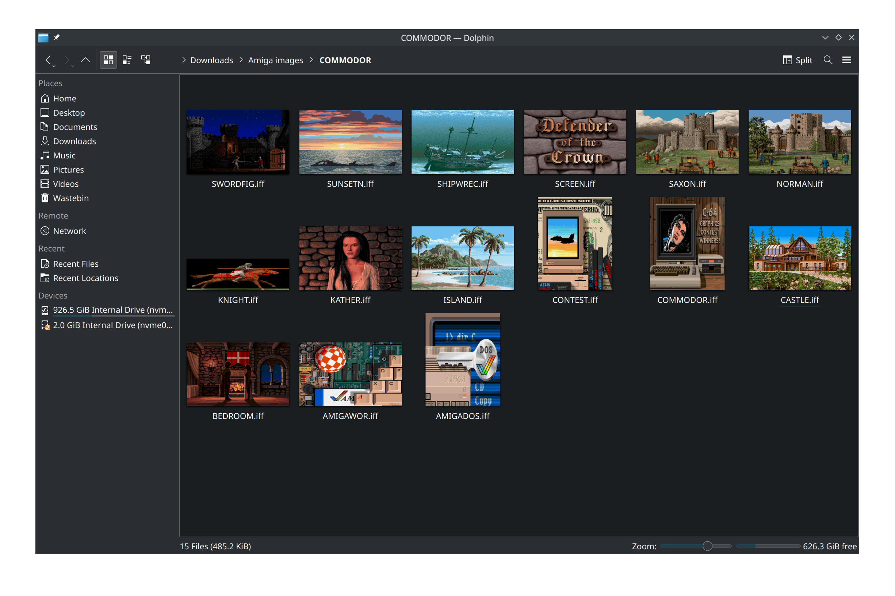

# ilbm-thumb-kde

This is a plugin for KDE Plasma to provide thumbnail support for Amiga IFF / ILBM files in Dolphin.

It not only resizes the IFF image for thumbnails, but it corrects the aspect ratio for full screen images to 4:3 (ie. 640x200 gets stretched to 640x480 first, 320x400 becomes 640x480).



## Build Instructions

Dependencies (in Ubuntu):
* cmake
* extra-cmake-modules
* libkf5kio-dev
* libmagick++-dev
* qtbase5-dev

The following instructions will build the plugin:

```
mkdir build
cd build
cmake -DCMAKE_BUILD_TYPE=Release
make
```

Watch for any errors in any step, you won't be able to continue until they are resolved.

Once this completes you can install using:

```
sudo make install
```

# Other Environments

For GNOME and other display environments, I have included `ilbm.thumbnailer`. This should be copied into `/user/share/thumbnailers` to add support. The thumbnailer file runs ImageMagick from command line to do the conversion, so you do not need this plugin. Unfortunately KDE Plasma does not support the thumbnailer standard.
