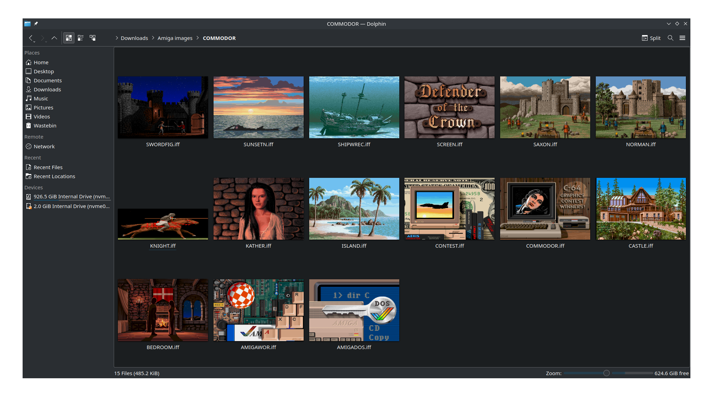

# ilbm-thumb-kde

This is a plugin for KDE Plasma to provide thumbnail support for Amiga IFF / ILBM files in Dolphin.

It not only resizes the IFF image for thumbnails, but it extracts the aspect ratio for the file and compensates for this. This is because Amigas can have resolutions such as 640x200 and 320x400 on a 4:3 screen, which will make the images seem squashed without the compensation.



## Build Instructions

Dependencies (in Ubuntu):
* cmake
* extra-cmake-modules
* libkf5kio-dev
* libmagick++-dev
* qtbase5-dev

The following instructions will build the plugin:

```
mkdir build
cd build
cmake -DCMAKE_BUILD_TYPE=Release
make
```

Watch for any errors in any step, you won't be able to continue until they are resolved.

Once this completes you can install using:

```
sudo make install
```

# Other Environments

For GNOME and other display environments, I have included `ilbm.thumbnailer`. This should be copied into `/user/share/thumbnailers` to add support. The thumbnailer file runs ImageMagick from command line to do the conversion, so you do not need this plugin. Unfortunately KDE Plasma does not support the thumbnailer standard.
